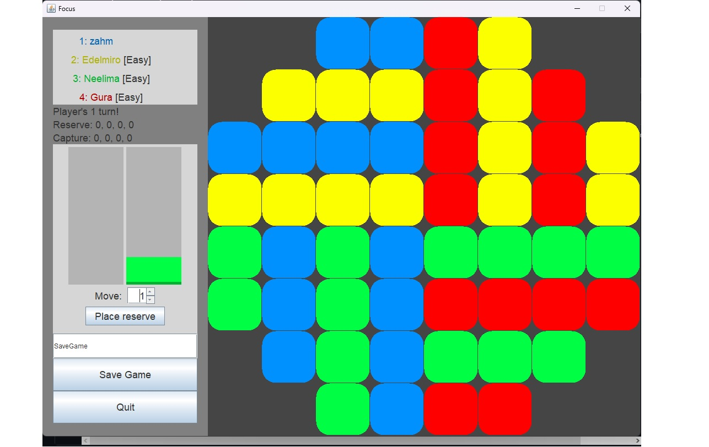

**Note:** _If access is ever needed to the private repoes with the code to the projects described below, please shoot me an email at waleedahmedhannan@gmail.com and I'd be happy to help :)_

**Video Demo Link:** https://www.youtube.com/watch?v=gIhIjDd9Nt0

### Focus (Domination) Board game project:

* Made a popular board game into a computer game using Java 
* Practiced good coding habits where we wrote tests, journaled our progress with complete by and review by dates for each individual
* Allows users to save game, load game, has accessibility options, choose upto 4 players (human or CPU) 

