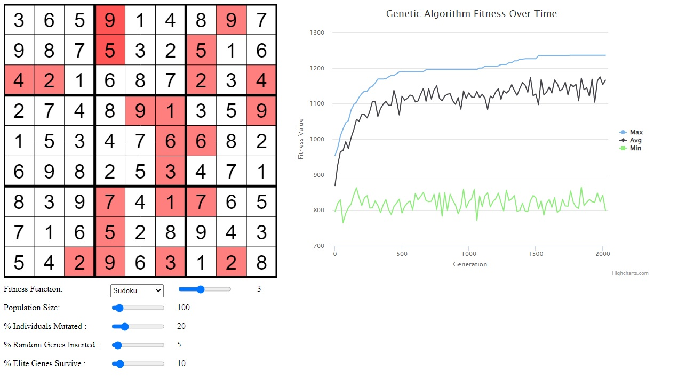

**Note:** _If access is ever needed to the private repoes with the code to the projects described below, please shoot me an email at waleedahmedhannan@gmail.com and I'd be happy to help :)_

### Sudoku Solver

- Created a soduku solver using genetic algorithms, this is fully functional and attempts to solve a variable soduko board of sizes 1x1 to 16x16 using genetic programming concepts such as fitness functions, mutatation, parent selection, reproduction, etc. 
- Has many options to change the options from the % Indivudals mutated.

