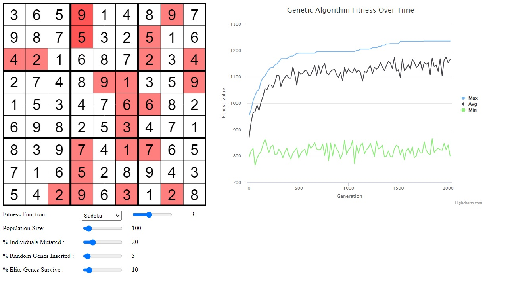

**Note:** _If access is ever needed to the private repoes with the code to the projects described below, please shoot me an email at waleedahmedhannan@gmail.com and I'd be happy to help :)_

**Video Demo Link:** https://www.youtube.com/watch?v=G-LZ6xV_olk

### Sudoku Solver

- Created a sudoku solver using genetic algorithms principles, this is fully functional and attempts to solve a variable soduko board of sizes 1x1 upto 16x16 using genetic programming concepts such as fitness functions, mutatation, parent selection, reproduction, etc. 
- Has many options to change the options from the % Indivudals mutated.
- Has different fitness functions but they are present mostly for testing purposes, decided to leave them in because they are kind of cool
- Has a graph of the max, avg, and minimum genetic algorithm fitness over the generations elapsed.

