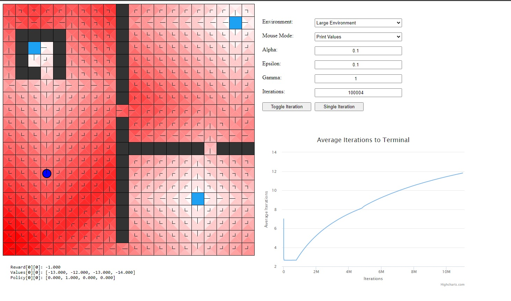

**Note:** _If access is ever needed to the private repoes with the code to the projects described below, please shoot me an email at waleedahmedhannan@gmail.com and I'd be happy to help :)_

**Video Demo Link:** [[https://www.youtube.com/watch?v=G-LZ6xV_olk](https://www.youtube.com/watch?v=bE-CYMXuAFk)](https://www.youtube.com/watch?v=bE-CYMXuAFk)

* Made a q-learning project where a bot tries to get to a terminal state which maximizes rewards but minimizing punishment
* The default reward of doing any move is -1 and reaching a goal state is a reward of 0, upon reaching a terminal state, the bot is ported to a random location on the map
* The user can place tile, remove tile, change rewards of locations, and move the bot
* There is also a visual graph to see the average iterations taken at each run of the program 

